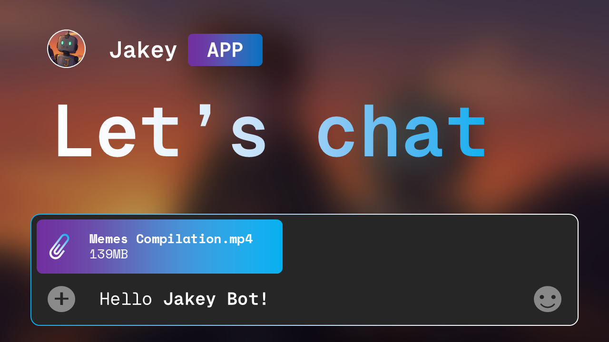
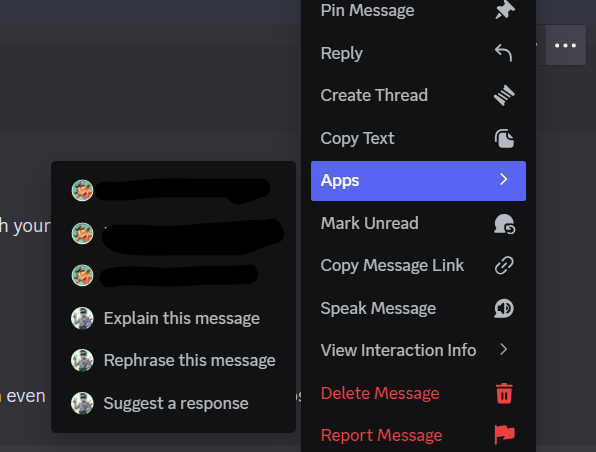

- [Jakey Bot](#jakey-bot)
  - [Platform availability](#platform-availability)
  - [Features](#features)
- [Installation and setup](#installation-and-setup)
  - [Required permissions for Discord bot](#required-permissions-for-discord-bot)
  - [Installation](#installation)
  - [Configuring](#configuring)
- [Get Started](#get-started)
  - [Chat](#chat)
    - [Chat Variables](#chat-variables)
  - [Model used](#model-used)
- [Commands](#commands)
- [FAQ](#faq)


# Jakey Bot
Jakey Bot is a multi-model AI and music bot with personality, designed to give you access to popular AI chatbots from Google Gemini, OpenAI, Anthropic, MoonShot AI, Z.AI, DeepSeek, OpenRouter right within Discord! 




## Platform availability
Jakey AI is available as Discord Bot. Other platforms is coming soon!

## Features
- Access to the top AI flagship models right within Discord! Both open and proprietary weights.
- Summarize text channels and messages
- Multimodality support and summarize file attachments!
- Browse, run python code, edit images right within chat
- Remix user's avatar

Other non-AI extras include:
- Mimic other users

# Installation and setup
## Required permissions for Discord bot
- Read message history for channel summaries
- Embed messages (required for rendering text more than 2000 and for most commands)
- Send messages
- Attach files
- Create webhooks (for mimic commands)
- Create/Use slash commands
- Create and send messages in threads
- View Channels
- Add Reactions

For demo version, you can add this bot and see the required permissions and capabilities: https://discord.com/oauth2/authorize?client_id=1051409808877699072&permissions=563330095107136&integration_type=0&scope=bot

Keep in mind that data training policy varies between model, if you need guaranteed data loss prevention, you need to provide your own endpoints.

## Installation
The best way to get started is through Docker method... You can directly pull the image from my Docker 🐳 Hub repository and simply run the bot below to pull the stable image.
```sh
~ $ docker pull zavocc/jakey:1.0
~ $ docker run -it --env-file dev.env --rm zavocc/jakey:1.0
# or by bind mounting dev.env (recommended)
# docker run --mount type=bind,source=dev.env,target=/jakeybot/dev.env --rm zavocc/jakey:1.0
```

If you want to use fresh from `master` commit builds of Jakey Docker image, pull using `zavocc/jakey:autobot` image  tag before hitting to stable version as minor revision.

NOTE: You need to provide [the dev.env file](#configuring) as explained below

> [!WARNING]
> Running JakeyBot on Windows using native `python.exe` is currently unsupported due to issues like emoji character encoding issues, and file paths used. As well as dependencies required that may not be fully covered under requirements.txt that requires other dependencies for the Win32 platform. We recommend using WSL2 or the Docker image with preconfigured environment.

<details>
  <summary>Manual installation</summary>
  But if you prefer manual method without using containers, you need to install Python version atleast 3.10+ with pip and venv is highly preferred and run the commands

  You must create a virtual environment before proceeding which you can do by running:
  ```
  python -m venv .venv

  # Activate
  . .venv/bin/activate
  ```

  Install dependencies as needed
  ```
  pip3 install -r requirements.txt
  ```
</details>

## Configuring
After you install the required dependencies, configure your bot first by heading over to [dev.env.template](./dev.env.template) and save it as `dev.env` in the gitroot directory

You will need to provide Discord bot token from the developers portal.

Please see [CONFIG.md](./docs/CONFIG.md) for more information about configuration.

# Get Started
Get started by asking Jakey **@Jakey what can you do?**

## Chat
Once you added or installed Jakey to your server or yourself, you can mention @Jakey along with your prompt or directly message Jakey in DMs. If you use Gemini model, you can prompt files such as images, audio, video, and visual PDFs too!

### Chat Variables
When you enter a prompt to Jakey... you can use chat variables which are substrings to detect which action to perform before sending the request to LLM

- `prompt /chat:ephemeral` - Do not append the last message turn to chat history while having its previous memory
- `prompt /chat:info` - Show model used in the conversation.

## Model used
The default model used is based on [models.yaml](./data/models.yaml) for chat and [text_models.yaml](./data/text_models.yaml) for text based tasks. You can customize default model based on your needs.

# Commands
Jakey provides slash commands such as:
- `/avatar remix` - Restyle user's avatar powered by Nano Banana
- `/avatar show` - Show and optionally describe user's avatar
- `/sweep` - Clear the conversation
- `/feature` - Extend Jakey skills by activating chat tools!
- `/model set` to list available models.
- `/openrouter` - Access additional models from OpenRouter (`/model set:openrouter` must be set)
- `/summarize` - Summarize the current text channel or thread and gather insights into a single summary thanks to Gemini 2.0 Flash's long context it can understand conversations even from the past decade!
- `/mimic` - Mimics other users using webhook

Jakey also has message actions or apps which is used to take action on a selected message. Such as explain, rephrase, or suggest messages.



# FAQ
Please see [FAQ](./docs/FAQ.md) for more information.