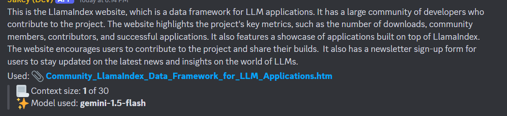

## Jakey Bot
Jakey Bot is a Gemini-based chatbot with personality, powered by Gemini 1.5 Pro and Flash


This chatbot is designed to utilize the [Gemini API](https://aistudio.google.com) and combine with best Python and Discord APIs to create a helpful chatbots

## UI/UX availability
Jakey AI is available as Discord Bot. Standalone UI is coming soon

## Features
- It uses the latest and greatest Gemini 1.5 models with extensive multimodal 
capabilties, this chatbot can accept text, images, video, and text files to input. With models to choose from
- Supports and uses code execution for accurate math, function call tools, and system instructions for personality
- It can summarize messages and integrate to Discord
- Chat history
- Gemini API requests are asynchronous

## Installation
Core dependencies is Python with PIP, depending on your distribution, pip must be installed separately along with venv. If you want to enable music chatbot mode, you'll also need to install ffmpeg/openjdk

### Required permissions for Discord bot
- Read message history (see [#faq](#faq) for privacy implications)
- Embed messages (required for rendering text more than 4096 and for most commands)
- Send messages (obviously)
- Attach files
- Create webhooks
- Create slash commands
- Voice related features such as connect, disconnect

### Required dependencies
- Python 3.10+ with pip \
    If you use Linux distros, I strongly require you to install Python with venv support due to [PEP 0668](https://peps.python.org/pep-0668/) and [PEP 0453](https://peps.python.org/pep-0453/) for rationale.

### Optional dependencies
- OpenJDK 17 with ffmpeg \
    Needed for voice commands (wavelink/lavalink) if needing to self-host lavalink server

There may be other dependencies needed for some operations such as tools. Please see [TOOLS.md](./docs/TOOLS.md) for rationale.

### Installation
Once you activated your enviornment and has pip ready, you can run
```
pip3 install -r requirements.txt
```

After you installed the dependencies, don't run `main.py` just yet. You must run these commands before installing, since Wavelink installs `discord.py` as dependency and we use `py-cord` due to ease of use
```
pip3 uninstall py-cord discord.py
pip3 install py-cord
```

## Configuring
<!-- Suggested code may be subject to a license. Learn more: ~LicenseLog:3141877449. -->
After you install the required dependencies, head over to [dev.env.template](./dev.env.template) and save it as `dev.env` in the gitroot directory

Required fields to configure:
- `TOKEN` - Your Discord Bot Token
- `GOOGLE_AI_TOKEN` - Gemini API token, please see [this link](https://aistudio.google.com/app/apikey) to obtain API keys (Its free)
- `SYSTEM_USER_ID` - Its strongly advisable you to use your Discord user ID for administrative commands like eval. You probably don't want me to control your infrastructure 😉
- `MONGO_DB_URL` - MongoDB Connection String to store data

Please see [CONFIG.md](./docs/CONFIG.md) for more information about configuration.

### Voice commands configuration:
#### Your own LavaLink server
You can enable VC-related commands such as `/voice play` (which plays videos from YouTube and other supported sources) by downloading [Lavalink jar file](https://github.com/lavalink-devs/Lavalink/releases) and placing it as `wavelink/Lavalink.jar` in project's root directory.

Activate voice by placing `Lavalink.jar` from lavalink releases and rename `application.yml.template` to `application.yml` and run `java -jar Lavalink.jar` in separate session before starting the bot.

---
#### Serverless lavalink
Alternatively, you can use the list of 3rd party servers from and use servers from https://lavalink.darrennathanael.com/NoSSL/lavalink-without-ssl/ and skip the installation step above and configure the `dev.env` file pointing the third party Lavalink servers, no installation required... Please see [CONFIG.md#voice](./docs/CONFIG.md#voice) for more information.

## Running the server
After everything is configured, you can run `main.py`

Get started by asking Jakey `/ask prompt:Who are you and how can I get started`

By default, it uses **Gemini 1.5 Flash** because it's cheap, widely used, and has the same multimodal and contextual capabilities as Pro but it is distilled which means it may not get the same capabilities as Pro, but it is much better than **1.0 Pro** and **GPT-3.5** but **GPT-4o mini** outclasses it. Please see [the LLM arena by livebench for comparison](https://livebench.ai/)

## Get started
Jakey provides commands such as:
- `/ask` - Ask Jakey anything!
  - Get started by asking `/ask` `prompt:` `Hey Jakey, I'm new, tell me your commands, features, and capabilities`
  - Accepts file attachments in image, video, audio, text files, and PDFs (with images) by passing `attachment:` parameter
  - Ephemeral conversation with `append_hist:True`
  - Show conversation and model info with `show_stats:True`
  - You can choose between **Gemini 1.5 Flash** or **Gemini 1.5 Pro** using `model:` parameter
- `/sweep` - Clear the conversation
- `/feature` - Extend Jakey skills by activating chat tools! (Clears conversation when feature are set)
- `/imagine` - Create images using Stable Diffusion 3
- `/summarize` - Summarize the current text channel or thread and gather insights into a single summary thanks to Gemini 1.5 Flash's long context it can understand conversations even from the past decade!
- `/mimic` - Mimics other users using webhook
- `/voice` - Basic streaming audio functionality from YouTube, soundcloud and more!

Jakey also has apps which is used to take action on a selected message. Such as explain, rephrase, or suggest messages.  


## FAQ
This is FAQ for people using this bot, please see [FAQ for technical users](./docs/FAQ.md) to understand how data is stored or how the code works under the hood.

### Why Jakey instead of standard Gemini personality?
Personality is implemented in the chatbot so to make it more human-like. However, it is based on a guy and Jakey's name is based on Jake which is mostly a masculine name (and no, don't expect Jakey to be your AI girlfriend). Prefer to keep it neutral however.

### Can it search the internet?
Web Search (beta) can be used by enabling it under `/feature` command capability named "Web Search with DuckDuckGo" and ask queries with keywords like "Search the web"

Web search performs in two steps
1. It searches the query through DuckDuckGo API and collects the links needed for page summarization
2. The list of URLs is then being scrapped and agregates them so the model can understand them

The maximum number of queries can be used is 6 to prevent tokens from depleting so quickly due to large articles and causing slower responses as context builds up and performs batch chunks of webpage scrapping its contents before the response get sent from the model.

Its recommended to use Gemini 1.5 Pro to better utilize Tool use but Flash also works. Keep in mind that the model sometimes cannot pick up the tool schema needed to perform web search action, if it fabricates its responses, explicitly tell the model to search the web, or improve your prompt.

Using web search can affect the response overall performance as chat history grows, however the webpages are embedded, chunked, and stores the embeddings through temporary vector database to efficiently provide and extract relevant context to the model from the large batch of chunked corpuses of webpage contents. By default, its using its default text transformer model to embed texts locally. Its recommended to use web search sparingly if you want the model to be aware with certain information. You can also tell the model how many searches it can perform (but queries are maximum to 6) optimally 2-3 searches.

Depending on a website, some pages may not be used for responses that does not have extractable textual data.

You can also attach HTML files manually as part of attachment if you want a single page summarization


### Are models free to use?
Yes, both 1.5 Pro and Flash are free to use, and the latter is used by default (overriden by `model:` parameter) \
The only limit is rate limit. 1.5 pro rate limits are usually lowest than flash.

If you have an account with higher rate limits, we suggest to self-host this bot and use your own API keys from [AI studio](https://aistudio.google.com) with billing enabled to serve your users. Vertex AI and other non-Google AI models are not supported at this time.

### Can this bot be user-installable?
You can use `/ask`, `/imagine` and `/sweep` commands in the bot's DM once you install this app by tapping "Add app" in its profile card and clicking "Try it yourself" otherwise you will get "Integration error" when directly using these commands in DMs.

https://support.discord.com/hc/en-us/articles/23957313048343-Moderating-Apps-on-Discord#h_01HZQQQEADYVN2CM4AX4EZGKHM

Keep in mind that after installing the app to yourself, mentioned commands are exposed anywhere even if the bot is not authorized in guilds you've joined. Using `/ask` and `/sweep` commands are not supported outside DMs or guilds where the bot is authorized despite it can be visible from anywhere if its installed by user scope. This is due to because some actions like `ctx.send` will prematurely end the command with `Missing Access` error.
